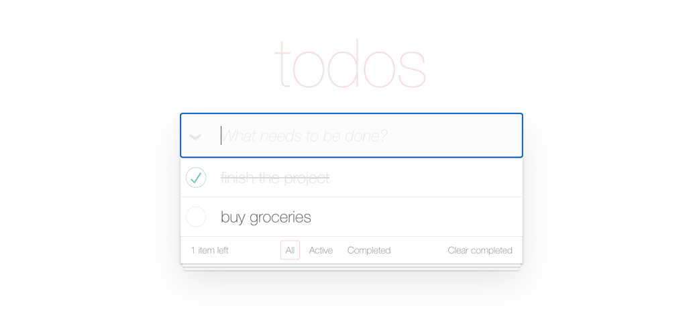

# Todo App

## Description
A dynamic and user-friendly todo application developed with React. It allows users to add, edit, delete, and filter tasks, with real-time updates and smooth interactions. The app is integrated with an external API to manage tasks. The clean, modern interface is designed for efficiency, offering a pleasant task management experience.

## Technologies used
* HTML5
* CSS3
* SASS
* Bulma
* JS (ES6+)
* React
* TypeScript
* Rest API
* Git

## Instructions for Working with the Project

	1. Open your terminal and run the following command to clone the repository:

        git clone https://github.com/modeltoIT/todo-app.git

	2. Move into the project directory:
    
        cd todo-app

	3. Ensure that Node.js version v20.x.x is installed. Verify this by running:
        
        node -v
        
        If the version is incorrect, install or update Node.js from Node.js official website.

	4. Install the necessary project dependencies by running:
        
        npm install

	5. Start the development server with the command:

        npm start

## View Project

* Live Demo: [View the Project](https://modeltoit.github.io/todo-app/)

## Preview

